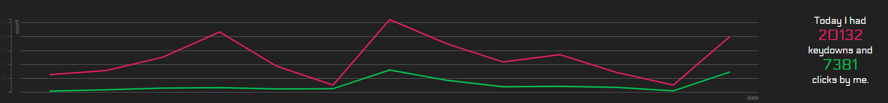

<p align="center">
  <br />
  A human motivation meter.<br />
  <br />
  <br />
</p>

# motiv-client-node

The client of motiv implemented by Node.js

## Install

```
$ git clone https://github.com/shundroid/motiv-client-node.git
```

### Settings

Set Server URL and Password.

preferences.js
```js
module.exports = { server: 'Your server url', password: 'Your password' }
```

## Links

[.NET Version](https://github.com/shundroid/motiv-client-net)

## Author

[shundroid](https://shundroid.netlify.com/)
